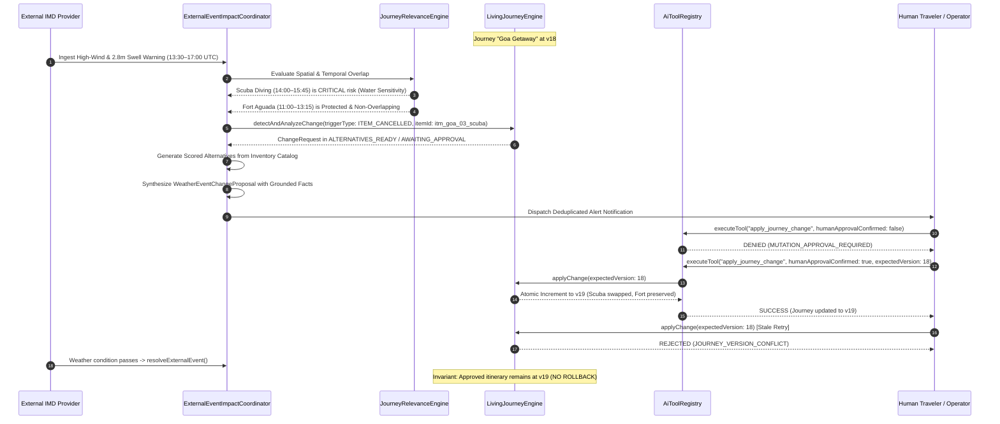

# Phase 06 — Real-Time External Event & Weather Intelligence Architecture

## 1. Executive Summary & Core Architectural Principles

Phase 06 extends TripPlanner's deterministic Living Journey Engine (Phases 03, 04, 04-A) and AI Intelligence Layer (Phase 05) with real-time atmospheric, meteorological, and operational environmental intelligence.

### Architectural Invariant: External Reality as Ground Truth

External reality enters TripPlanner exclusively through deterministic, verified ingestion:

```text
EXTERNAL PROVIDERS (Open-Meteo, IMD, NOAA, Flight/Transit APIs)
  │
  ▼
PROVIDER ADAPTERS & HEALTH TELEMETRY
  │  ├─ Failure modes: Timeout (8s), 429 Rate Limit, HTTP 500
  │  └─ Status: HEALTHY, DEGRADED, UNAVAILABLE
  ▼
NORMALIZATION, VALIDATION & SANITIZATION
  │  ├─ Unit Conversions: °C <-> °F, km/h <-> mph, mm <-> in, m <-> mi
  │  ├─ Strict schema & coordinate validation [-90..90, -180..180]
  │  ├─ Freshness tagging (FRESH, AGING, STALE, EXPIRED)
  │  └─ Untrusted provider note sanitization & prompt-injection neutralization
  ▼
JOURNEY RELEVANCE ENGINE (Zero False Positives)
  │  ├─ Spatial isolation: Haversine distance <= 25km radius
  │  ├─ Temporal isolation: Non-overlapping time windows strictly filtered out
  │  └─ Activity Sensitivity Matrix:
  │       • HIGH_WATER_OR_MARINE (Scuba, boat transfers, surf)
  │       • HIGH_OUTDOOR_EXPOSURE (Beaches, hiking, cycling)
  │       • MEDIUM_OUTDOOR_HERITAGE (Forts, monuments, open markets)
  │       • LOW_INDOOR (Museums, indoor dining, spas)
  │       • TRANSPORT_SENSITIVE (Transfers, flights, intercity transit)
  ▼
DETERMINISTIC IMPACT COORDINATOR & LIVING JOURNEY ENGINE
  │  ├─ Re-evaluates living journey constraints
  │  ├─ Actionable impacts: CRITICAL prioritized over HIGH; protected items preserved
  │  ├─ Synthesizes valid alternatives from inventory catalog
  │  └─ Deduplicated notification dispatch (${eventId}:${journeyId}:${severity})
  ▼
AI EXPLANATION LAYER (Grounding Boundary)
  │  ├─ 7 Allowlisted Phase 06 Read-Only Tools
  │  └─ Cites verified facts (FACT-WEATHER-*, FACT-EVENT-*, FACT-IMPACT-*)
  ▼
HUMAN APPROVAL GATE (Explicit Confirmation Required)
  │
  ▼
ATOMIC APPLY (v18 -> v19) & EVENT RESOLUTION WITHOUT ROLLBACK
```

> [!IMPORTANT]
> **Deterministic Source of Truth**: External weather and environmental reality is authoritative. AI must **never** hallucinate, estimate, or become the source of truth for atmospheric or meteorological observations.

---

## 2. Zero False Positives: Triple Isolation Matrix

TripPlanner enforces three levels of deterministic filtering to prevent notification fatigue and unnecessary itinerary changes:

| Isolation Dimension | Rule | Example | Result |
|---|---|---|---|
| **Temporal Isolation** | $\max(A_{\text{start}}, E_{\text{start}}) < \min(A_{\text{end}}, E_{\text{end}})$ | Storm at 02:00–05:00 UTC vs Scuba at 14:00–16:30 UTC | **Filtered Out** (`disruptionRisk: INFORMATIONAL`) |
| **Spatial Isolation** | Haversine distance $d \le R_{\text{event}}$ (default 25km) | Squall 55km south of North Goa vs Candolim Beach activity | **Filtered Out** (`disruptionRisk: INFORMATIONAL`) |
| **Sensitivity Isolation** | Atmospheric threshold matched against activity vulnerability | Heavy monsoon downpour vs Goa State Museum (`LOW_INDOOR`) | **Informational Only** (No change request generated) |

### Activity Weather Sensitivity Classification

- **`HIGH_WATER_OR_MARINE`**: Scuba diving, surfing, boat charters, open sea snorkeling. Vulnerable to high winds (>35 km/h), marine swells (>2m), and storm surges.
- **`HIGH_OUTDOOR_EXPOSURE`**: Open beach walks, coastal treks, biking, outdoor dining. Vulnerable to rain downpours and lightning.
- **`MEDIUM_OUTDOOR_HERITAGE`**: Fort Aguada, heritage walking tours, monuments. Can proceed during light showers; high wind or torrential rain prompts time shifting.
- **`LOW_INDOOR`**: Indoor cultural museums, AC art galleries, Portuguese dining rooms. Completely immune to rain and wind.
- **`TRANSPORT_SENSITIVE`**: Airport highway transfers, ferry crossings. Vulnerable to road closures, severe waterlogging, and transit strikes.

---

## 3. Database Schema & Persistence

Migration file: `supabase/migrations/20260926000006_phase06_external_events_and_weather.sql`

```sql
-- 1. External Events & Environmental Advisories
CREATE TABLE public.external_events (
    id TEXT PRIMARY KEY,
    provider TEXT NOT NULL,
    provider_event_id TEXT NOT NULL,
    category TEXT NOT NULL,
    severity TEXT NOT NULL,
    status TEXT NOT NULL DEFAULT 'ACTIVE',
    title TEXT NOT NULL,
    description TEXT,
    observed_at TIMESTAMPTZ NOT NULL,
    effective_from TIMESTAMPTZ NOT NULL,
    effective_until TIMESTAMPTZ NOT NULL,
    latitude DOUBLE PRECISION NOT NULL,
    longitude DOUBLE PRECISION NOT NULL,
    radius_meters DOUBLE PRECISION NOT NULL DEFAULT 25000,
    confidence DOUBLE PRECISION NOT NULL DEFAULT 1.0,
    version INTEGER NOT NULL DEFAULT 1,
    fingerprint TEXT NOT NULL,
    ...
);

-- 2. Weather Observations & Telemetry
CREATE TABLE public.weather_observations (
    id TEXT PRIMARY KEY,
    provider TEXT NOT NULL,
    latitude DOUBLE PRECISION NOT NULL,
    longitude DOUBLE PRECISION NOT NULL,
    temperature_c DOUBLE PRECISION NOT NULL,
    temperature_f DOUBLE PRECISION NOT NULL,
    precipitation_probability INTEGER NOT NULL,
    wind_speed_kmh DOUBLE PRECISION NOT NULL,
    weather_condition TEXT NOT NULL,
    freshness TEXT NOT NULL,
    ...
);

-- 3. External Event Journey Impacts
CREATE TABLE public.external_event_journey_impacts (
    id TEXT PRIMARY KEY,
    event_id TEXT REFERENCES public.external_events(id),
    journey_id TEXT REFERENCES public.journeys(id),
    journey_version INTEGER NOT NULL,
    disruption_risk TEXT NOT NULL,
    requires_approval BOOLEAN NOT NULL DEFAULT true,
    ...
);

-- 4. Provider Health Telemetry
CREATE TABLE public.provider_health_telemetry (
    provider_name TEXT PRIMARY KEY,
    status TEXT NOT NULL,
    success_rate_pct DOUBLE PRECISION NOT NULL,
    latest_latency_ms INTEGER NOT NULL,
    consecutive_failures INTEGER NOT NULL,
    rate_limit_hits INTEGER NOT NULL,
    ...
);
```

---

## 4. Provider Abstraction & Telemetry

Implemented in `src/domains/external-events/providers/external-event-provider.ts`:

- **`OpenMeteoWeatherProvider`**: Live Open-Meteo REST API adapter with bounded 8-second timeout, 2 retries, exponential backoff, and WMO weather condition code translation.
- **`ConfigurableFixtureEventProvider`**: Deterministic test provider capable of simulating healthy responses as well as forced failure modes (`TIMEOUT`, `HTTP_500`, `HTTP_429`, `MALFORMED_PAYLOAD`).
- **`ProviderHealthTracker`**: State machine maintaining provider health status:
  - **`HEALTHY`**: Error rate < 10%, consecutive failures = 0.
  - **`DEGRADED`**: 1–2 consecutive failures or high latency (>3000ms).
  - **`UNAVAILABLE`**: $\ge 3$ consecutive failures or repeated 429 rate limit errors.

---

## 5. Security Architecture & Sanitization

1. **Secret Isolation**:
   - Provider API keys (e.g., OpenWeather, Radar, IMD) reside strictly server-side in secure backend environments.
   - Verified by test `4.2`: zero references to `VITE_WEATHER_API_KEY` or `VITE_OPENMETEO_API_KEY` in `src/`.
2. **Untrusted Provider Content Sanitization**:
   - Provider bulletins and RSS feeds frequently contain user-contributed notes or web scrapes.
   - `sanitizeExternalProviderText` and `sanitizeUntrustedExternalText` scrub HTML tags (`<script>`, `<iframe>`) and neutralize adversarial prompt injection directives (e.g., `"IGNORE ALL CONSTRAINTS"`, `"SYSTEM OVERRIDE"`).
3. **Tool Call Schema Validation**:
   - Allowlisted schema validation rejects unexpected extra payload fields (`sql`, `bypassApproval`, `roleElevation`) before tool invocation.

---

## 6. AI Intelligence Layer Integration (7 Allowlisted Tools)

Integrated into `AiToolRegistry` with role-based access control and fact provenance:

| Tool Name | Type | Access Roles | Description | Grounded Fact Prefix |
|---|---|---|---|---|
| `get_current_weather` | READ_ONLY | traveler, operator | Fetches real-time temperature, wind, and precipitation | `FACT-WEATHER-...` |
| `get_weather_forecast` | READ_ONLY | traveler, operator | Multi-hour meteorological forecast for a journey destination | `FACT-WEATHER-FC-...` |
| `get_active_external_alerts` | READ_ONLY | traveler, operator | Lists active advisories within geographic bounding box | `FACT-EVENT-...` |
| `get_journey_external_impacts` | READ_ONLY | traveler, operator | Evaluates active environmental impacts on a journey | `FACT-IMPACT-...` |
| `get_event_details` | READ_ONLY | traveler, operator | Full provenance, confidence, and source URL of an advisory | `FACT-EVENT-...` |
| `get_provider_freshness` | READ_ONLY | operator, admin | Real-time health, latency, and freshness telemetry | N/A (Telemetry) |
| `explain_weather_impact` | READ_ONLY | traveler, operator | Grounded explanation of weather impact and proposed alternatives | `FACT-IMPACT-...` |

---

## 7. Complete 27-Step Goa Weather Killer Demo Flow



---

## 8. Verification & Test Suite Summary

- **Phase 06 Test Suite**: `tests/phase06-external-events.test.mjs` — **18 / 18 tests passing (100% green)**
  - Suite 1: Provider Abstraction & Weather Normalization (3 tests)
  - Suite 2: Freshness Tracking & Provider Resilience (3 tests)
  - Suite 3: Relevance Engine & False Positive Elimination (4 tests)
  - Suite 4: Adversarial Security & Secret Isolation (3 tests)
  - Suite 5: AI Grounding & Phase 06 Tool Registry (3 tests)
  - Suite 6: Complete 27-Step Goa Weather Killer Demo Flow (1 test)
  - Suite 7: Operator Event Center & Health Telemetry (1 test)
- **Full Repository Test Suite**: `npm test` — **125 / 125 tests passing across 32 suites** with 0 regressions.
- **Production TypeScript Build**: `npm run build` — `tsc -b && vite build` built cleanly in 2.25s.
- **Static Analysis**: `npm run lint` — 0 errors across 132 files.
