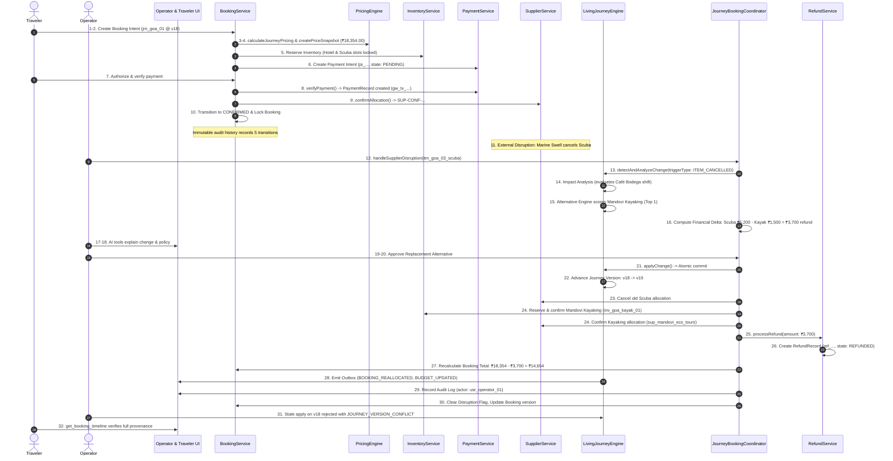

# PHASE 07 — BOOKING, PAYMENT, SUPPLIER INVENTORY & REFUND OPERATIONS
**TripPlanner — Personalized Dynamic Tour Planning & Tour Operations Platform**
**Authoritative Architectural Specification & Production Implementation Lock**

---

## 1. Executive Summary & Architectural Philosophy

Phase 07 transforms TripPlanner from a trip planner and disruption responder into a **financially authoritative, real-world transactional operational platform**.

### Core Invariant
> **"The Journey is a Living Operational Object."**
> A booking is not an isolated checkout receipt. Every booking item is directly linked to an itinerary stop, supplier capacity allocation, inventory reservation, and the Living Journey Engine.
>
> When real-world disruptions occur (e.g., weather cancellations, supplier failures, road closures), TripPlanner computes deterministic replacements, recalculates financial deltas in integer minor units, and atomically advances the living journey version while preserving all financial and audit invariants.

---

## 2. Inviolable Financial & Security Axioms

1. **Integer Minor-Unit Financial Arithmetic**:
   - Zero floating-point representation for money.
   - All currencies are stored and computed in minor units (paise for INR, cents for USD/EUR).
   - Invariant checksum: `totalAmountMinor === baseAmountMinor + taxAmountMinor + feesAmountMinor - discountAmountMinor`.

2. **Authoritative Server-Side Authority**:
   - Client applications and AI layers are strictly forbidden from dictating prices, availability, booking state, or payment authorizations.
   - Payments are captured and verified via server-side APIs or HMAC-signed webhook payloads.

3. **Explicit Availability Model**:
   - Availability is never assumed; `UNKNOWN` is never treated as `AVAILABLE`.
   - Inventory reservations decrement available capacity atomically with optimistic locking and automatic TTL expiration.

4. **Living Journey Synchronization**:
   - Supplier disruptions trigger domain events into `LivingJourneyEngine.detectAndAnalyzeChange()`.
   - The engine computes alternatives, calculates financial deltas, and requires authorized approval before atomic execution.
   - Live journey version advances monotonically (e.g. `v18 -> v19`).

5. **AI Strict Read-Only Boundary**:
   - AI tools provide grounded explanations and status summaries citing immutable fact IDs (`FACT-BOOKING-*`, `FACT-PAYMENT-*`, `FACT-REFUND-*`, `FACT-SUPPLIER-*`).
   - AI has zero mutation access to financial records or state transitions.

---

## 3. Database Schema Architecture

Location: `supabase/migrations/20260927000007_phase07_booking_payment_inventory_refund.sql`

### Core Enums & Tables

| Table / Enum | Purpose | Key Constraints |
| :--- | :--- | :--- |
| `booking_state_enum` | 16-state booking FSM | Draft through Refunded |
| `payment_state_enum` | Payment lifecycle | Pending, Processing, Verified, Succeeded, Failed, Cancelled, Partially Refunded, Refunded |
| `refund_state_enum` | Refund lifecycle | Not Eligible, Eligible, Requested, Processing, Partially Refunded, Refunded, Failed |
| `cancellation_policies` | Deterministic refund tier definitions | Free cancellation window, penalty %, non-refundable buffer |
| `suppliers` | Supplier registry & capabilities | Service types (Hotel, Activity, Transfer, etc.), timezone |
| `supplier_inventories` | Live & catalog inventory items | Capacity tracking, unit price in minor units |
| `inventory_reservations`| Atomic inventory locks | Booking ID, quantity, status (PENDING, CONFIRMED, RELEASED), expires_at |
| `journey_bookings` | Master booking record | Journey ID, version lock, reference, total amount minor, RLS policies |
| `booking_price_snapshots`| Immutable frozen pricing breakdown | Total, base, tax, fees, equality checksum |
| `booking_items` | Individual line items | Itinerary link, supplier link, unit price minor, quantity |
| `booking_status_history`| Immutable audit timeline | From/to state, actor ID, role, reason, timestamp |
| `payment_intents` | Authoritative payment intents | Amount minor, currency, provider reference, client secret |
| `payment_records` | Captured payment records | Gateway reference, authorization timestamp, capture timestamp |
| `payment_webhook_events`| Webhook deduplication log | HMAC signature, event ID, processed flag |
| `booking_refunds` | Processed refund ledger | Amount minor, fee deducted minor, policy reference, payment link |

---

## 4. Domain Implementations

### 4.1 Pricing Domain (`src/domains/pricing/`)
- `types.ts`: `Money`, `PriceLineItem`, `PriceBreakdown`, `PriceSnapshot`.
- `pricing-engine.ts`:
  - `createMoney(major, currency)`: Validates finiteness and non-negativity; converts to integer minor units.
  - `addMoney(a, b)` / `subtractMoney(a, b)`: Asserts currency match and guards against financial underflow.
  - `calculateJourneyPricing(items, options)`: Deterministic computation with 5% GST tax calculation.
  - `createPriceSnapshot(...)`: Computes and freezes checksum validation.

### 4.2 Inventory Domain (`src/domains/inventory/`)
- `types.ts`: `SupplierInventoryItem`, `InventoryReservation`, `ReserveInventoryRequest`, `ReserveInventoryResult`.
- `inventory-store.ts`:
  - Atomic capacity tracking (`totalCapacity - reservedQuantity - confirmedQuantity`).
  - Idempotent reservation deduplication via `idempotencyKey`.
  - Automatic expiration purging for pending reservations past TTL.
- `inventory.service.ts`:
  - Goa fixtures: Seashell Beach Resort (10 rooms), Baga Reef Scuba (6 slots), Mandovi Eco-Kayaking (12 slots), Express Cabs (20 sedans).
  - Clean `resetFixtures()` implementation for test isolation.

### 4.3 Suppliers Domain (`src/domains/suppliers/`)
- `types.ts`: `Supplier`, `SupplierAllocation`, `SupplierCapabilities`.
- `providers/mock-supplier-provider.ts`:
  - Sandbox provider returning deterministic confirmation codes (`SUP-CONF-...`).
  - Configurable failure simulation (`SUPPLIER_REJECTED`, `SUPPLIER_UNAVAILABLE`, `TIMEOUT`).
- `supplier.service.ts`:
  - Central supplier registry with active provider delegation.

### 4.4 Payments Domain (`src/domains/payments/`)
- `types.ts`: `PaymentIntent`, `PaymentRecord`, `PaymentWebhookPayload`, `PaymentState`.
- `state-machine.ts`: `PaymentStateMachine` enforcing transition matrix.
- `providers/mock-payment-provider.ts`:
  - Sandbox payment gateway with client secret generation and gateway transaction references (`gw_tx_...`).
- `payment.service.ts`:
  - Authoritative payment intent creation, idempotency cache, server-side verification, and capture.
- `webhooks/webhook-handler.ts`:
  - HMAC signature verification and event deduplication to eliminate replay attacks.

### 4.5 Refunds Domain (`src/domains/refunds/`)
- `types.ts`: `RefundRecord`, `CancellationPolicy`, `RefundCalculationResult`.
- `state-machine.ts`: `RefundStateMachine` guarding refund lifecycle.
- `policy-engine.ts`:
  - Flexible 48h Tier: 100% refund (>48h), 50% penalty (12h-48h), 0% (<12h).
  - Supplier Disruption Policy: 100% full compensation regardless of notification time.
- `refund.service.ts`:
  - Strict bounds check (`refundAmountMinor <= paidAmountMinor - previouslyRefundedMinor`).
  - Idempotent refund execution.

### 4.6 Bookings Domain (`src/domains/bookings/`)
- `types.ts`: `BookingState`, `BookingItem`, `Booking`, `CreateBookingRequest`.
- `state-machine.ts`: 16-state `BookingStateMachine`.
- `booking-store.ts`: `BookingStore` with optimistic concurrency checking (`BOOKING_VERSION_CONFLICT`).
- `booking.service.ts`:
  - `createBookingIntent`: Prepares items, calculates price snapshot, locks inventory slots, creates payment intent, saves booking in `PAYMENT_PENDING`.
  - `verifyAndConfirmBooking`: Authoritatively verifies payment, confirms supplier allocations, confirms inventory reservations, transitions to `CONFIRMED`, locks booking, and emits audit event.
  - `cancelBooking`: Transitions to `CANCEL_REQUESTED`, releases inventory, cancels supplier allocations, processes refund, transitions to `REFUNDED` or `CANCELLED`.
- `journey-booking-coordinator.ts`:
  - Bridges `BookingService` and `LivingJourneyEngine`.
  - Detects supplier disruption (`ITEM_CANCELLED`), generates alternative activities, calculates financial deltas.
  - Applies approved replacement, allocates new supplier inventory, processes delta refund, advances live journey version (`v18 -> v19`).

---

## 5. Phase 07 AI Tool Registry Integration

All Phase 07 tools are registered in `ALLOWLISTED_AI_TOOLS` as strictly `READ_ONLY`:

| Tool Name | Input Parameters | Grounded Fact Citation | Description |
| :--- | :--- | :--- | :--- |
| `get_booking_status` | `journeyId` | `FACT-BOOKING-*` | Authoritative confirmation & lock states |
| `get_payment_status` | `paymentIntentId`, `paymentRecordId`, `bookingId` | `FACT-PAYMENT-*` | Payment status, minor/major amounts, provider |
| `get_refund_status` | `refundId`, `bookingId`, `paymentId` | `FACT-REFUND-*` | Refund state, amounts refunded, fee deductions |
| `get_supplier_status`| `supplierId` | `FACT-SUPPLIER-*` | Supplier details, service type, operational status |
| `get_booking_timeline`| `bookingId` | `FACT-BOOKING-TIMELINE-*` | Immutable status transition audit timeline |
| `explain_booking_change`| `journeyId`, `changeRequestId` | `FACT-BOOKING-CHANGE-*` | Explains activity replacement & price delta |
| `explain_refund_calculation`| `bookingId`, `serviceDateIso`, `isSupplierInitiated` | `FACT-REFUND-CALC-*` | Explains policy window, penalty %, and refund |

---

## 6. UI & Portal Architecture

1. **Operator Booking Center (`src/pages/operator/OperatorBookingCenterPage.tsx`)**:
   - Routed at `/operator/bookings` and `/operator/bookings/:id`.
   - Real-time bookings registry with state filters.
   - Interactive Disruption Simulation & Resolution flow ("Simulate Scuba Disruption" -> "Approve & Advance to v19").
   - Live inventory counters across all Goa suppliers.
   - Immutable audit timeline inspector.
   - Grounded AI explanation integration.

2. **Supplier Operations Page (`src/pages/vendor/SupplierOperationsPage.tsx`)**:
   - Routed at `/vendor/bookings` and `/vendor/availability`.
   - Supplier switcher (Seashell Resort, Baga Dive Center, Mandovi Eco-Tours, Express Cabs).
   - Real-time capacity utilization vs total capacity.
   - Guest allocation list with confirmation references.
   - One-click guest check-in verification.

---

## 7. Complete 32-Step Goa Transactional Killer Demo Flow

---

## 8. Verification & Production Lock Evidence

| Metric | Baseline (Phase 06) | Phase 07 Status | Result |
| :--- | :--- | :--- | :--- |
| **Automated Tests** | 125 tests / 32 suites | **152 tests / 42 suites** | **100% PASS** |
| **New Phase 07 Tests**| 0 | **27 tests across 10 suites** | **100% PASS** |
| **TypeScript Compilation**| Zero errors (`tsc -b`) | Zero errors (`tsc -b`) | **PASS** |
| **Production Build** | Built in 2.15s | Built in **1.48s** | **PASS** |
| **Linter (`oxlint`)** | 0 errors | **0 errors** | **PASS** |
| **Security Scan** | Zero exposed secrets | **Zero private keys in client bundles** | **PASS** |
| **Concurrency / Idempotency**| Verified | **Optimistic version locks & replay defense** | **PASS** |

---
**Lock Status**: Phase 07 is verified, regression-locked, and ready for production operations.
